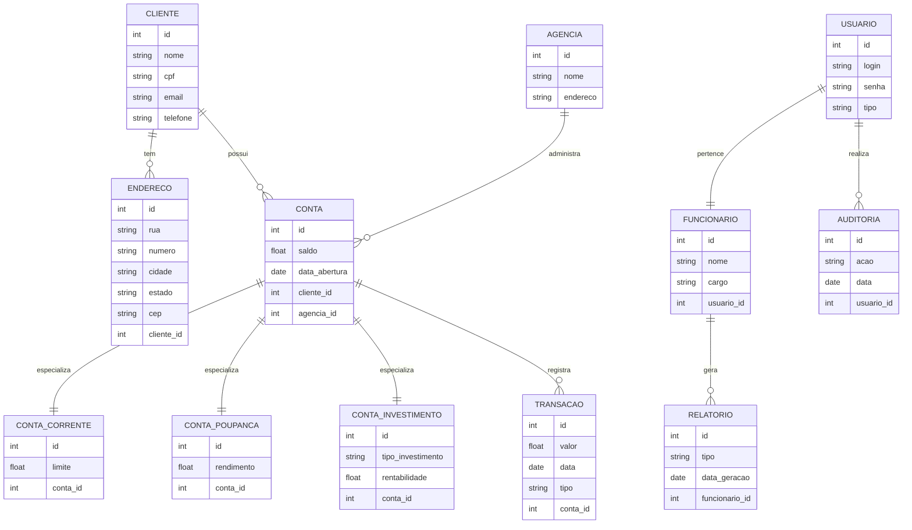
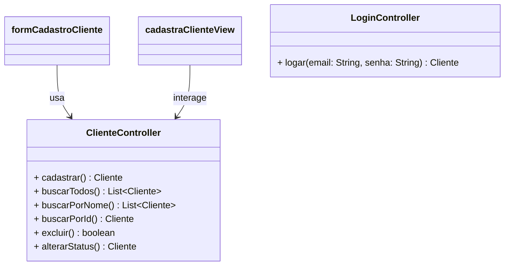

# 🏦 VantaBank

VantaBank é uma plataforma de banco digital moderna, segura e escalável, desenvolvida para oferecer serviços bancários completos com uma experiência de usuário intuitiva. O projeto visa simular um sistema bancário real com funcionalidades como gerenciamento de contas, transferências, pagamentos, histórico de transações, e muito mais.

---

## 🚀 Funcionalidades Principais

- Cadastro e autenticação de usuários (com autenticação JWT)
- Gerenciamento de contas bancárias
- Transferências entre contas
- Pagamentos e boletos
- Histórico de transações
- Avaliações de serviços e suporte ao cliente
- Painel administrativo para gestão de usuários e operações

---

## 🛠️ Tecnologias Utilizadas

### 🧠 Backend
- **Node.js** com **Express.js**
- **TypeScript**
- **PostgreSQL** com **Prisma ORM**
- **Redis** (para cache e filas)
- **JWT** para autenticação
- **Zod** para validação de dados
- **Swagger** para documentação da API

### 💻 Frontend
- **React.js** com **TypeScript**
- **Vite** para build rápido
- **Tailwind CSS** para estilização
- **React Query** para gerenciamento de dados
- **React Hook Form** + **Zod** para formulários

### ☁️ DevOps & Infraestrutura
- **Docker** e **Docker Compose**
- **Nginx** como reverse proxy
- **GitHub Actions** para CI/CD
- **AWS (EC2, RDS, S3)** ou **Render** para deploy
- **Sentry** para monitoramento de erros
- **Postman** para testes de API

---

## 🧱 Estrutura do Projeto

vanta-bank/ ├── backend/ │ ├── src/ │ │ ├── controllers/ │ │ ├── services/ │ │ ├── routes/ │ │ ├── middlewares/ │ │ ├── prisma/ │ │ └── utils/ │ └── Dockerfile ├── frontend/ │ ├── src/ │ │ ├── pages/ │ │ ├── components/ │ │ ├── hooks/ │ │ ├── services/ │ │ └── styles/ │ └── Dockerfile ├── docker-compose.yml ├── README.md └── .github/workflows/

---

## 🗂️ Diagrama Entidade-Relacionamento (ERD)

---

## 🧩 Diagrama da Camada DAO

```mermaid
classDiagram
    class Conexao {
        - Connection conexao
        + conectar() Connection
        + getConexao() Connection
    }

    class ContaDao {
        <<abstract>>
        - Connection conexao
        + ContaDao()
        + depositar(valor: float) Conta
        + sacar(valor: float) Conta
        + transferir(conta: Conta, valor: float) Conta
        + extrato(conta: Conta, dataInicio: Date, dataFim: Date) List~Transacao~
    }

    class ContaPoupancaDao {
        - Connection conexao
        + ContaPoupanca()
        + cadastrar(contaPoupanca: ContaPoupanca) ContaPoupanca
        + alterar(contaPoupanca: ContaPoupanca) ContaPoupanca
        + buscarTodos() List~ContaPoupanca~
        + alterarStatus() ContaPoupanca
        + buscarPorConta() ContaPoupanca
    }

    class AgenciaDao {
        - Connection conexao
        + Agencia()
        + cadastrar(agencia: Agencia) Agencia
        + alterar(agencia: Agencia) Agencia
        + buscarTodos() List~Agencia~
        + alterarStatus() Agencia
        + buscarPorCodigo() Agencia
    }

    class AuditoriaDao {
        - Connection conexao
        + AuditoriaDao()
        + registrar() Auditoria
    }

    class ClienteDao {
        - Connection conexao
        + ClienteDao()
        + cadastrar(cliente: Cliente) Cliente
        + alterar(cliente: Cliente) Cliente
        + buscarTodos() List~Cliente~
        + buscarPorNome(nome: String) List~Cliente~
        + buscarPorId(id: int) Cliente
        + excluir(id: int) boolean
        + alterarStatus(id: int) Cliente
    }

    class FuncionarioDao {
        - Connection conexao
        + FuncionarioDao()
        + cadastrar(funcionario: Funcionario) Funcionario
        + alterar(funcionario: Funcionario) Funcionario
        + buscarTodos() List~Funcionario~
        + buscarPorNome(nome: String) List~Funcionario~
        + buscarPorId(id: int) Funcionario
        + excluir(funcionario: Funcionario) boolean
    }

    class TransacaoDao {
        - Connection conexao
        + Transacao()
        + registrar(transacao: Transacao) Transacao
        + listarPorData(conta: Conta, dataInicio: Date, dataFim: Date) List~Transacao~
    }

    class LoginDao {
        - Connection conexao
        + logar() Cliente
    }

    class ContaCorrenteDao {
        - Connection conexao
        + ContaCorrenteDao()
        + cadastrar(contaCorrente: ContaCorrente) ContaCorrente
        + alterar(contaCorrente: ContaCorrente) ContaCorrente
        + buscarTodos() List~Agencia~
        + alterarStatus(contaCorrente: ContaCorrente) ContaCorrente
        + buscarPorConta() ContaCorrente
    }

    class ContaInvestimentoDao {
        - Connection conexao
    }

    class RelatorioDao {
        - Connection conexao
    }

    ContaPoupancaDao --|> ContaDao
    ContaCorrenteDao --|> ContaDao
    ContaInvestimentoDao --|> ContaDao
```

---

## 🖥️ Diagrama da Camada View e Controller

---

# 🧪 Como Rodar Localmente

## Pré-requisitos
- Node.js (v18+)
- Docker e Docker Compose
- PostgreSQL (caso não use Docker)
- Yarn ou npm

---

## Passos

### Clone o repositório
- git clone https://github.com/seu-usuario/vanta-bank.git
- cd vanta-bank

### Suba os containers
docker-compose up --build

- Acesse o frontend em http://localhost:3000
- Acesse a API em http://localhost:3333

# 🧠 Futuras Melhorias
- Integração com Open Finance (Pix, TED, etc.)

- Suporte a múltiplas moedas

- Aplicativo mobile com React Native

- Módulo de investimentos e crédito

- Autenticação com biometria (WebAuthn)

# 👨‍💻 Contribuindo
Contribuições são bem-vindas! Sinta-se à vontade para abrir issues ou pull requests.

# ✨ Autor
Desenvolvido com 💜 por João para revolucionar o futuro dos bancos digitais.
